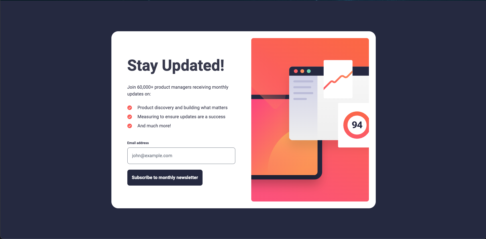
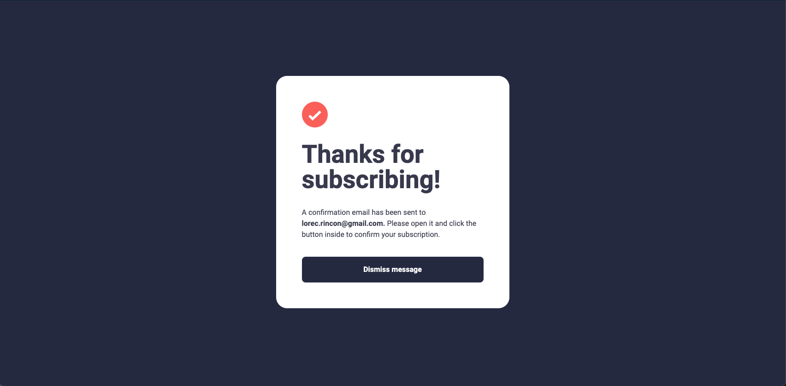

# Frontend Mentor - Newsletter sign-up form with success message solution

This is a solution to the [Newsletter sign-up form with success message challenge on Frontend Mentor](https://www.frontendmentor.io/challenges/newsletter-signup-form-with-success-message-3FC1AZbNrv). Frontend Mentor challenges help you improve your coding skills by building realistic projects.

## Table of contents

- [Overview](#overview)
  - [The challenge](#the-challenge)
  - [Screenshot](#screenshot)
  - [Links](#links)
- [My process](#my-process)
  - [Built with](#built-with)
- [Author](#author)
- [Acknowledgments](#acknowledgments)

## Overview

### The challenge

Users should be able to:

- Add their email and submit the form
- See a success message with their email after successfully submitting the form
- See form validation messages if:
  - The field is left empty
  - The email address is not formatted correctly
- View the optimal layout for the interface depending on their device's screen size
- See hover and focus states for all interactive elements on the page

### Screenshot





### Links

- Solution URL: [GitHub Repository](https://github.com/lorenacrincon/newsletter-sign-up-with-success-message)
- Live Site URL: [Add live site URL here](https://your-live-site-url.com)

## My process

### Built with

- Semantic HTML5 markup
- CSS custom properties
- Flexbox
- CSS Grid
- Mobile-first workflow
- [React](https://reactjs.org/) - JS library
- [Vite.js](https://vitejs.dev/)
- [Tailwind css](https://tailwindcss.com/) - For styles

```html
<form onSubmit="{handleSubmit}">
  <label className="mt-4 flex justify-between" htmlFor="email">
    <h3 className="font-bold text-xs">Email address</h3>
    {message && (
    <span className="text-red-500 text-xs font-bold inline-flex">
      {message}
    </span>
    )}
  </label>
  <input onChange={handleOnChange} id="email" value={email} type="email"
  className={`form-input my-2 block w-full rounded-lg p-4 ${ message ?
  "border-orange-400 focus:ring-orange-400 focus:border-orange-400 bg-orange-50"
  : "focus:ring-gray-400 focus:border-gray-400" }`}
  placeholder="john@example.com" />
  <button className="rounded-lg my-btn p-4 mt-3 text-white font-bold text-base">
    Subscribe to monthly newsletter
  </button>
</form>
```

```css
:root {
  font-family: "Roboto", sans-serif;
  font-size: 16px;

  background-color: var(--darkSlateGrey);
  color: var(--charcoalGrey);

  /*PRIMARY*/
  --tomato: hsl(4, 100%, 67%);
  --pink: hsl(351, 100%, 67%);
  /*NEUTRAL*/
  --darkSlateGrey: hsl(234, 29%, 20%);
  --charcoalGrey: hsl(235, 18%, 26%);
  --grey: hsl(231, 7%, 60%);
  --white: hsl(0, 0%, 100%);
}
```

```js
function App() {
  const [email, setEmail] = useState("");
  const [message, setMessage] = useState("");
  const [isSubmitted, setIsSubmitted] = useState(false);

  const handleOnChange = (e) => {
    setEmail(e.target.value);
  };

  const handleSubmit = (event) => {
    event.preventDefault();
    const regEx = /^[a-zA-Z0-9._%+-]+@[a-zA-Z0-9.-]+\.[a-zA-Z]{2,8}$/;
    if (regEx.test(email)) {
      setIsSubmitted(true);
    } else if (email === "") {
      setMessage("Please enter email");
    } else if (!regEx.test(email)) {
      setMessage("Valid email required");
    } else {
      setMessage("");
    }
  };
  return (
    <>
      <SignUp
        email={email}
        handleSubmit={handleSubmit}
        message={message}
        isSubmitted={isSubmitted}
        handleOnChange={handleOnChange}
      />
      <Attribution />
    </>
  );
}
```

## Author

- GitHub Profile - [Lorena Rincón](https://github.com/lorenacrincon)
- Frontend Mentor - [@yourusername](https://www.frontendmentor.io/profile/lorenacrincon)
